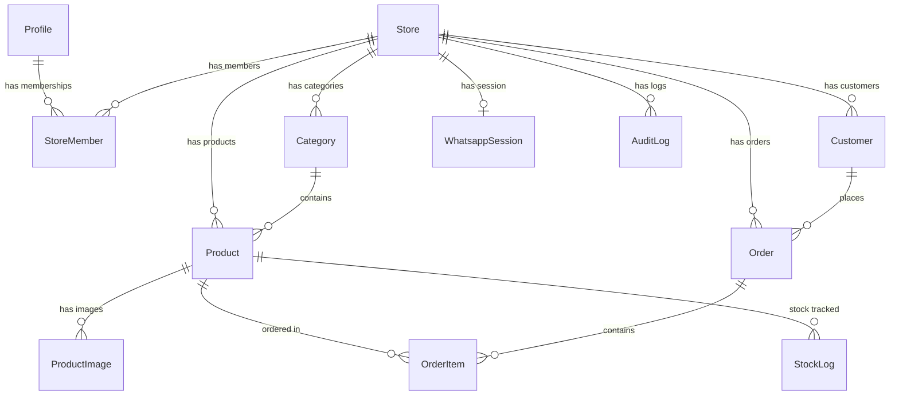
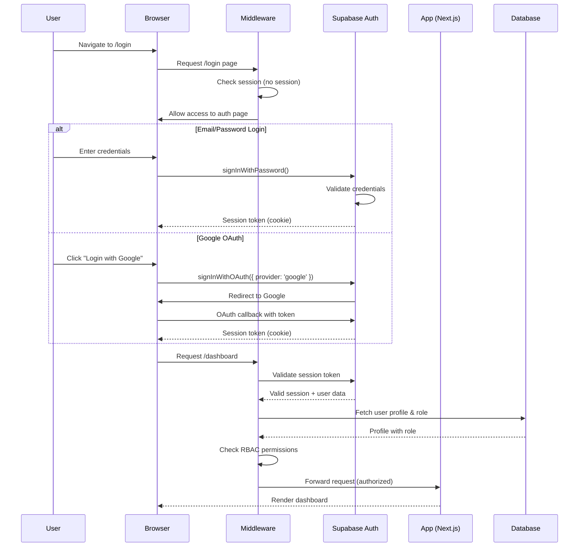

# ARCHITECTURE — NexPOS

> **Version:** 1.0.0-dev
> **Last Updated:** 2026-06-04

---

## 1. System Overview

NexPOS follows a **modular monolith** architecture built on **Next.js App Router** with a separate **WhatsApp Bot microservice**. The web application handles all dashboard functionality, API routes, and AI integration. The WhatsApp service runs independently on a VPS and communicates with the main application via REST APIs.

```
┌─────────────────────────────────────────────────────────────────┐
│                         CLIENTS                                 │
│                                                                 │
│   ┌──────────┐    ┌──────────────┐    ┌─────────────────────┐   │
│   │ Browser  │    │ WhatsApp App │    │ Mobile Browser      │   │
│   │ (Admin)  │    │ (Customer)   │    │ (Responsive)        │   │
│   └────┬─────┘    └──────┬───────┘    └──────────┬──────────┘   │
└────────┼─────────────────┼───────────────────────┼──────────────┘
         │                 │                       │
         ▼                 ▼                       ▼
┌─────────────────┐  ┌───────────────┐   ┌─────────────────┐
│   Vercel CDN    │  │  VPS Server   │   │   Vercel CDN    │
│   (Web App)     │  │  (WA Service) │   │   (Web App)     │
│                 │  │               │   │                 │
│  Next.js 15     │  │  Node.js      │   │  Next.js 15     │
│  App Router     │◄─┤  whatsapp-    │   │  App Router     │
│  API Routes     │  │  web.js       │   │  (Responsive)   │
│  Server Actions │  │               │   │                 │
└────────┬────────┘  └───────┬───────┘   └────────┬────────┘
         │                   │                     │
         ▼                   ▼                     ▼
┌─────────────────────────────────────────────────────────────┐
│                    EXTERNAL SERVICES                         │
│                                                             │
│  ┌──────────────┐  ┌──────────┐  ┌───────────────────────┐  │
│  │  Supabase    │  │ Google   │  │  Supabase Storage     │  │
│  │  PostgreSQL  │  │ Gemini   │  │  (Images/Files)       │  │
│  │  + Auth      │  │ AI API   │  │                       │  │
│  └──────────────┘  └──────────┘  └───────────────────────┘  │
└─────────────────────────────────────────────────────────────┘
```

---

## 2. Architecture Layers

### 2.1 Layer Diagram

```
┌───────────────────────────────────────────────────┐
│                PRESENTATION LAYER                  │
│  React Server Components, Client Components,       │
│  Pages, Layouts, shadcn/ui                         │
├───────────────────────────────────────────────────┤
│                APPLICATION LAYER                   │
│  API Routes, Server Actions, Middleware,           │
│  Request Validation (Zod), Auth Guards             │
├───────────────────────────────────────────────────┤
│                 SERVICE LAYER                      │
│  Business Logic, Gemini AI Service,                │
│  WhatsApp Service, Report Generator,               │
│  Notification Service                              │
├───────────────────────────────────────────────────┤
│                DATA ACCESS LAYER                   │
│  Prisma ORM, Supabase Client,                      │
│  Repository Pattern                                │
├───────────────────────────────────────────────────┤
│               INFRASTRUCTURE LAYER                 │
│  PostgreSQL, Supabase Auth, Supabase Storage,      │
│  Gemini API, WhatsApp Web                          │
└───────────────────────────────────────────────────┘
```

### 2.2 Layer Responsibilities

| Layer              | Responsibility                                 | Key Files                                               |
| :----------------- | :--------------------------------------------- | :------------------------------------------------------ |
| **Presentation**   | UI rendering, user interaction, form handling  | `src/app/**/page.tsx`, `src/components/**`              |
| **Application**    | Request handling, validation, auth enforcement | `src/app/api/**`, `src/schemas/**`, `src/middleware.ts` |
| **Service**        | Business logic, external API orchestration     | `src/services/**`                                       |
| **Data Access**    | Database queries, ORM operations               | `src/lib/prisma.ts`, Prisma schema                      |
| **Infrastructure** | External system connections, configuration     | `src/lib/**`, `.env`                                    |

---

## 3. Directory Structure (Detailed)

```
ai-pos-system/
├── docs/                          # Project documentation
│   ├── PRD.md
│   ├── ARCHITECTURE.md
│   ├── DESIGN.md
│   ├── SECURITY.md
│   ├── TESTING.md
│   ├── DEPLOYMENT.md
│   └── TASK_INSTRUCTION.md
├── prisma/
│   ├── schema.prisma              # Database schema
│   ├── migrations/                # Migration files
│   └── seed.ts                    # Seed data script
├── public/
│   ├── images/                    # Static images
│   ├── icons/                     # App icons & favicons
│   └── fonts/                     # Local font files (if any)
├── src/
│   ├── app/
│   │   ├── [locale]/              # Locale-scoped routes
│   │   │   ├── layout.tsx         # Root locale layout (providers, theme)
│   │   │   ├── page.tsx           # Landing / redirect to dashboard
│   │   │   ├── (auth)/            # Auth route group (no layout nesting)
│   │   │   │   ├── login/
│   │   │   │   │   └── page.tsx
│   │   │   │   ├── register/
│   │   │   │   │   └── page.tsx
│   │   │   │   └── forgot-password/
│   │   │   │       └── page.tsx
│   │   │   ├── (dashboard)/       # Dashboard route group
│   │   │   │   ├── layout.tsx     # Dashboard layout (sidebar, header)
│   │   │   │   ├── dashboard/
│   │   │   │   │   └── page.tsx   # Dashboard overview
│   │   │   │   ├── categories/
│   │   │   │   │   ├── page.tsx   # Category list
│   │   │   │   │   └── [id]/
│   │   │   │   │       └── page.tsx  # Category detail/edit
│   │   │   │   ├── products/
│   │   │   │   │   ├── page.tsx   # Product list
│   │   │   │   │   └── [id]/
│   │   │   │   │       └── page.tsx  # Product detail/edit
│   │   │   │   ├── orders/
│   │   │   │   │   ├── page.tsx   # Order list
│   │   │   │   │   └── [id]/
│   │   │   │   │       └── page.tsx  # Order detail
│   │   │   │   ├── pos/
│   │   │   │   │   └── page.tsx   # Manual POS interface
│   │   │   │   ├── reports/
│   │   │   │   │   └── page.tsx   # Sales reports & analytics
│   │   │   │   ├── ai-assistant/
│   │   │   │   │   └── page.tsx   # AI chat interface
│   │   │   │   ├── whatsapp/
│   │   │   │   │   └── page.tsx   # WhatsApp management
│   │   │   │   ├── settings/
│   │   │   │   │   ├── page.tsx   # General settings
│   │   │   │   │   ├── store/
│   │   │   │   │   │   └── page.tsx
│   │   │   │   │   ├── team/
│   │   │   │   │   │   └── page.tsx
│   │   │   │   │   └── profile/
│   │   │   │   │       └── page.tsx
│   │   │   │   └── users/         # Superadmin only
│   │   │   │       └── page.tsx
│   │   │   └── not-found.tsx
│   │   ├── api/
│   │   │   ├── auth/
│   │   │   │   ├── callback/
│   │   │   │   │   └── route.ts   # OAuth callback handler
│   │   │   │   └── confirm/
│   │   │   │       └── route.ts   # Email confirmation
│   │   │   ├── categories/
│   │   │   │   ├── route.ts       # GET (list), POST (create)
│   │   │   │   └── [id]/
│   │   │   │       └── route.ts   # GET, PUT, DELETE
│   │   │   ├── products/
│   │   │   │   ├── route.ts
│   │   │   │   └── [id]/
│   │   │   │       └── route.ts
│   │   │   ├── orders/
│   │   │   │   ├── route.ts
│   │   │   │   └── [id]/
│   │   │   │       └── route.ts
│   │   │   ├── reports/
│   │   │   │   ├── revenue/
│   │   │   │   │   └── route.ts
│   │   │   │   ├── products/
│   │   │   │   │   └── route.ts
│   │   │   │   └── summary/
│   │   │   │       └── route.ts
│   │   │   ├── ai/
│   │   │   │   ├── chat/
│   │   │   │   │   └── route.ts   # AI chat endpoint (streaming)
│   │   │   │   └── analyze/
│   │   │   │       └── route.ts   # AI analysis endpoint
│   │   │   ├── whatsapp/
│   │   │   │   ├── status/
│   │   │   │   │   └── route.ts   # WA connection status
│   │   │   │   ├── connect/
│   │   │   │   │   └── route.ts   # Initiate WA connection
│   │   │   │   ├── disconnect/
│   │   │   │   │   └── route.ts
│   │   │   │   └── webhook/
│   │   │   │       └── route.ts   # Incoming WA messages
│   │   │   ├── upload/
│   │   │   │   └── route.ts       # File upload to Supabase Storage
│   │   │   └── users/
│   │   │       ├── route.ts
│   │   │       └── [id]/
│   │   │           └── route.ts
│   │   └── layout.tsx             # Root layout (html, body, fonts)
│   ├── components/
│   │   ├── ui/                    # shadcn/ui components ONLY
│   │   │   ├── button.tsx
│   │   │   ├── input.tsx
│   │   │   ├── dialog.tsx
│   │   │   ├── table.tsx
│   │   │   ├── card.tsx
│   │   │   ├── toast.tsx
│   │   │   ├── dropdown-menu.tsx
│   │   │   ├── select.tsx
│   │   │   ├── form.tsx
│   │   │   ├── badge.tsx
│   │   │   ├── avatar.tsx
│   │   │   ├── skeleton.tsx
│   │   │   ├── sheet.tsx
│   │   │   ├── tabs.tsx
│   │   │   ├── chart.tsx
│   │   │   └── ... (other shadcn components)
│   │   ├── shared/                # Reusable components across features
│   │   │   ├── app-sidebar.tsx
│   │   │   ├── app-header.tsx
│   │   │   ├── data-table.tsx     # Generic data table component
│   │   │   ├── page-header.tsx
│   │   │   ├── confirm-dialog.tsx
│   │   │   ├── empty-state.tsx
│   │   │   ├── loading-spinner.tsx
│   │   │   ├── error-boundary.tsx
│   │   │   ├── theme-toggle.tsx
│   │   │   ├── language-switcher.tsx
│   │   │   ├── search-input.tsx
│   │   │   ├── status-badge.tsx
│   │   │   ├── stat-card.tsx
│   │   │   ├── image-upload.tsx
│   │   │   └── pagination-controls.tsx
│   │   ├── dashboard/             # Dashboard-specific components
│   │   │   ├── revenue-chart.tsx
│   │   │   ├── top-products-chart.tsx
│   │   │   ├── recent-orders.tsx
│   │   │   ├── kpi-cards.tsx
│   │   │   └── low-stock-alert.tsx
│   │   ├── categories/            # Category feature components
│   │   │   ├── category-form.tsx
│   │   │   ├── category-list.tsx
│   │   │   └── category-card.tsx
│   │   ├── products/              # Product feature components
│   │   │   ├── product-form.tsx
│   │   │   ├── product-list.tsx
│   │   │   ├── product-card.tsx
│   │   │   └── stock-adjustment-dialog.tsx
│   │   ├── orders/                # Order feature components
│   │   │   ├── order-list.tsx
│   │   │   ├── order-detail.tsx
│   │   │   ├── order-status-badge.tsx
│   │   │   └── order-timeline.tsx
│   │   ├── pos/                   # POS feature components
│   │   │   ├── pos-product-grid.tsx
│   │   │   ├── pos-cart.tsx
│   │   │   └── pos-checkout-dialog.tsx
│   │   ├── reports/               # Reports feature components
│   │   │   ├── report-filters.tsx
│   │   │   ├── revenue-report.tsx
│   │   │   ├── product-report.tsx
│   │   │   └── export-button.tsx
│   │   ├── ai/                    # AI feature components
│   │   │   ├── ai-chat.tsx
│   │   │   ├── ai-message.tsx
│   │   │   ├── ai-suggested-prompts.tsx
│   │   │   └── ai-summary-card.tsx
│   │   ├── whatsapp/              # WhatsApp feature components
│   │   │   ├── qr-code-display.tsx
│   │   │   ├── connection-status.tsx
│   │   │   └── message-log.tsx
│   │   ├── auth/                  # Auth feature components
│   │   │   ├── login-form.tsx
│   │   │   ├── register-form.tsx
│   │   │   ├── forgot-password-form.tsx
│   │   │   └── oauth-buttons.tsx
│   │   └── settings/              # Settings feature components
│   │       ├── store-settings-form.tsx
│   │       ├── profile-form.tsx
│   │       └── team-management.tsx
│   ├── contexts/
│   │   └── whatsapp-context.tsx   # WhatsApp connection state
│   ├── hooks/
│   │   ├── use-auth.ts            # Auth state hook
│   │   ├── use-categories.ts      # Category CRUD hooks
│   │   ├── use-products.ts        # Product CRUD hooks
│   │   ├── use-orders.ts          # Order CRUD hooks
│   │   ├── use-reports.ts         # Report data hooks
│   │   ├── use-ai-chat.ts         # AI chat hook
│   │   ├── use-whatsapp.ts        # WhatsApp connection hook
│   │   ├── use-debounce.ts        # Debounce utility hook
│   │   ├── use-pagination.ts      # Pagination state hook
│   │   └── use-media-query.ts     # Responsive breakpoint hook
│   ├── i18n/
│   │   ├── routing.ts             # next-intl routing config
│   │   └── request.ts             # next-intl request config
│   ├── layouts/
│   │   └── dashboard-layout.tsx   # Dashboard shell (sidebar + header + main)
│   ├── lib/
│   │   ├── prisma.ts              # Prisma client singleton
│   │   ├── supabase/
│   │   │   ├── client.ts          # Supabase browser client
│   │   │   ├── server.ts          # Supabase server client
│   │   │   └── middleware.ts      # Supabase middleware client
│   │   ├── gemini.ts              # Gemini AI client initialization
│   │   ├── utils.ts               # cn() helper for shadcn
│   │   └── constants.ts           # App-wide constants
│   ├── messages/
│   │   ├── id/                    # Indonesian translations
│   │   │   ├── common.json        # Shared UI text (buttons, labels, etc.)
│   │   │   ├── auth.json          # Auth-related text
│   │   │   ├── dashboard.json     # Dashboard text
│   │   │   ├── categories.json    # Category management text
│   │   │   ├── products.json      # Product management text
│   │   │   ├── orders.json        # Order management text
│   │   │   ├── reports.json       # Reports text
│   │   │   ├── ai.json            # AI assistant text
│   │   │   ├── whatsapp.json      # WhatsApp management text
│   │   │   ├── settings.json      # Settings text
│   │   │   └── validation.json    # Validation error messages
│   │   └── en/                    # English translations (mirror structure)
│   │       ├── common.json
│   │       ├── auth.json
│   │       ├── dashboard.json
│   │       ├── categories.json
│   │       ├── products.json
│   │       ├── orders.json
│   │       ├── reports.json
│   │       ├── ai.json
│   │       ├── whatsapp.json
│   │       ├── settings.json
│   │       └── validation.json
│   ├── providers/
│   │   ├── query-provider.tsx     # TanStack React Query provider
│   │   ├── theme-provider.tsx     # next-themes provider
│   │   ├── session-provider.tsx   # Auth session provider
│   │   ├── toast-provider.tsx     # Toast notification provider
│   │   └── intl-provider.tsx      # Locale/i18n provider (if needed)
│   ├── schemas/
│   │   ├── auth.schema.ts         # Login/register validation
│   │   ├── category.schema.ts     # Category form validation
│   │   ├── product.schema.ts      # Product form validation
│   │   ├── order.schema.ts        # Order validation
│   │   ├── settings.schema.ts     # Settings validation
│   │   └── common.schema.ts       # Shared schemas (pagination, filters)
│   ├── services/
│   │   ├── auth.service.ts        # Auth API calls
│   │   ├── category.service.ts    # Category API calls
│   │   ├── product.service.ts     # Product API calls
│   │   ├── order.service.ts       # Order API calls
│   │   ├── report.service.ts      # Report API calls
│   │   ├── ai.service.ts          # Gemini AI API calls
│   │   ├── whatsapp.service.ts    # WhatsApp API calls
│   │   ├── upload.service.ts      # File upload API calls
│   │   └── user.service.ts        # User management API calls
│   ├── types/
│   │   ├── api.types.ts           # API response/request types
│   │   ├── auth.types.ts          # Auth-related types
│   │   ├── category.types.ts      # Category types
│   │   ├── product.types.ts       # Product types
│   │   ├── order.types.ts         # Order types
│   │   ├── report.types.ts        # Report types
│   │   ├── ai.types.ts            # AI types
│   │   ├── whatsapp.types.ts      # WhatsApp types
│   │   ├── user.types.ts          # User & role types
│   │   └── common.types.ts        # Shared utility types
│   ├── utils/
│   │   ├── format-currency.ts     # Currency formatting (IDR)
│   │   ├── format-date.ts         # Date formatting per locale
│   │   ├── format-number.ts       # Number formatting
│   │   ├── generate-order-id.ts   # Order ID generator
│   │   ├── role-permissions.ts    # Permission checking utility
│   │   ├── api-response.ts        # Standardized API response builder
│   │   └── cn.ts                  # shadcn className utility
│   └── middleware.ts              # Next.js middleware (auth + i18n + RBAC)
├── wa-service/                    # WhatsApp Bot Service (separate process)
│   ├── src/
│   │   ├── index.ts               # Entry point
│   │   ├── bot/
│   │   │   ├── client.ts          # whatsapp-web.js client setup
│   │   │   ├── handlers/
│   │   │   │   ├── menu.handler.ts
│   │   │   │   ├── order.handler.ts
│   │   │   │   ├── help.handler.ts
│   │   │   │   ├── status.handler.ts
│   │   │   │   ├── cart.handler.ts
│   │   │   │   ├── checkout.handler.ts
│   │   │   │   └── cancel.handler.ts
│   │   │   ├── formatters/
│   │   │   │   ├── menu.formatter.ts
│   │   │   │   ├── receipt.formatter.ts
│   │   │   │   └── order.formatter.ts
│   │   │   └── middleware/
│   │   │       ├── rate-limiter.ts
│   │   │       └── session-manager.ts
│   │   ├── api/
│   │   │   └── nexpos-client.ts   # API client to call NexPOS backend
│   │   └── config/
│   │       └── index.ts           # WA service configuration
│   ├── package.json
│   └── tsconfig.json
├── .env.example
├── .env.local                     # (gitignored)
├── .eslintrc.json
├── .prettierrc
├── .gitignore
├── AGENTS.md
├── next.config.ts
├── package.json
├── postcss.config.js
├── tailwind.config.ts
├── tsconfig.json
└── components.json                # shadcn/ui configuration
```

---

## 4. Database Schema (Prisma)

### 4.1 Complete Schema

```prisma
// prisma/schema.prisma

generator client {
  provider = "prisma-client-js"
}

datasource db {
  provider  = "postgresql"
  url       = env("DATABASE_URL")
  directUrl = env("DIRECT_URL")
}

// ─── ENUMS ────────────────────────────────────────

enum UserRole {
  SUPERADMIN
  ADMIN
  OPERATOR
}

enum OrderStatus {
  NEW
  CONFIRMED
  PROCESSING
  COMPLETED
  CANCELLED
}

enum PaymentStatus {
  PENDING
  PAID
  PARTIAL
  REFUNDED
}

enum PaymentMethod {
  CASH
  TRANSFER
  E_WALLET
}

enum OrderSource {
  WHATSAPP
  MANUAL
}

enum ProductStatus {
  ACTIVE
  INACTIVE
  OUT_OF_STOCK
}

// ─── MODELS ───────────────────────────────────────

model Profile {
  id          String   @id @default(uuid())
  userId      String   @unique  // References Supabase auth.users.id
  email       String   @unique
  fullName    String
  avatarUrl   String?
  phone       String?
  role        UserRole @default(OPERATOR)
  isActive    Boolean  @default(true)
  createdAt   DateTime @default(now())
  updatedAt   DateTime @updatedAt

  // Relations
  storeMembers StoreMember[]

  @@map("profiles")
}

model Store {
  id           String   @id @default(uuid())
  name         String
  slug         String   @unique
  description  String?
  logoUrl      String?
  address      String?
  phone        String?
  email        String?
  currency     String   @default("IDR")
  taxRate      Decimal  @default(0) @db.Decimal(5, 2)
  taxEnabled   Boolean  @default(false)
  timezone     String   @default("Asia/Jakarta")
  isActive     Boolean  @default(true)
  createdAt    DateTime @default(now())
  updatedAt    DateTime @updatedAt

  // Relations
  members         StoreMember[]
  categories      Category[]
  products        Product[]
  orders          Order[]
  customers       Customer[]
  whatsappSession WhatsappSession?
  auditLogs       AuditLog[]

  @@map("stores")
}

model StoreMember {
  id        String   @id @default(uuid())
  storeId   String
  profileId String
  role      UserRole @default(OPERATOR)
  joinedAt  DateTime @default(now())

  // Relations
  store   Store   @relation(fields: [storeId], references: [id], onDelete: Cascade)
  profile Profile @relation(fields: [profileId], references: [id], onDelete: Cascade)

  @@unique([storeId, profileId])
  @@map("store_members")
}

model Category {
  id          String   @id @default(uuid())
  storeId     String
  nameId      String   // Indonesian name
  nameEn      String   // English name
  descriptionId String? // Indonesian description
  descriptionEn String? // English description
  imageUrl    String?
  sortOrder   Int      @default(0)
  isActive    Boolean  @default(true)
  createdAt   DateTime @default(now())
  updatedAt   DateTime @updatedAt

  // Relations
  store    Store     @relation(fields: [storeId], references: [id], onDelete: Cascade)
  products Product[]

  @@map("categories")
}

model Product {
  id                String        @id @default(uuid())
  storeId           String
  categoryId        String
  sku               String
  nameId            String        // Indonesian name
  nameEn            String        // English name
  descriptionId     String?       // Indonesian description
  descriptionEn     String?       // English description
  price             Decimal       @db.Decimal(12, 2)
  discountPrice     Decimal?      @db.Decimal(12, 2)
  costPrice         Decimal?      @db.Decimal(12, 2) // COGS
  stock             Int           @default(0)
  minStockThreshold Int           @default(5)
  unit              String        @default("pcs")
  weight            Decimal?      @db.Decimal(8, 2)
  status            ProductStatus @default(ACTIVE)
  createdAt         DateTime      @default(now())
  updatedAt         DateTime      @updatedAt

  // Relations
  store      Store          @relation(fields: [storeId], references: [id], onDelete: Cascade)
  category   Category       @relation(fields: [categoryId], references: [id], onDelete: Restrict)
  images     ProductImage[]
  orderItems OrderItem[]
  stockLogs  StockLog[]

  @@unique([storeId, sku])
  @@map("products")
}

model ProductImage {
  id        String   @id @default(uuid())
  productId String
  url       String
  altText   String?
  sortOrder Int      @default(0)
  createdAt DateTime @default(now())

  // Relations
  product Product @relation(fields: [productId], references: [id], onDelete: Cascade)

  @@map("product_images")
}

model StockLog {
  id            String   @id @default(uuid())
  productId     String
  previousStock Int
  newStock      Int
  adjustment    Int      // positive = add, negative = subtract
  reason        String   // e.g., "order", "manual_adjustment", "restock"
  referenceId   String?  // e.g., orderId
  createdBy     String   // profileId
  createdAt     DateTime @default(now())

  // Relations
  product Product @relation(fields: [productId], references: [id], onDelete: Cascade)

  @@map("stock_logs")
}

model Customer {
  id        String   @id @default(uuid())
  storeId   String
  name      String
  phone     String
  email     String?
  notes     String?
  createdAt DateTime @default(now())
  updatedAt DateTime @updatedAt

  // Relations
  store  Store   @relation(fields: [storeId], references: [id], onDelete: Cascade)
  orders Order[]

  @@unique([storeId, phone])
  @@map("customers")
}

model Order {
  id             String        @id @default(uuid())
  storeId        String
  customerId     String?
  orderNumber    String        // Format: NX-YYYYMMDD-XXXX
  status         OrderStatus   @default(NEW)
  source         OrderSource   @default(MANUAL)
  subtotal       Decimal       @db.Decimal(12, 2)
  taxAmount      Decimal       @default(0) @db.Decimal(12, 2)
  discountAmount Decimal       @default(0) @db.Decimal(12, 2)
  totalAmount    Decimal       @db.Decimal(12, 2)
  paymentMethod  PaymentMethod?
  paymentStatus  PaymentStatus @default(PENDING)
  notes          String?
  customerName   String?       // Denormalized for quick display
  customerPhone  String?       // Denormalized for quick display
  createdAt      DateTime      @default(now())
  updatedAt      DateTime      @updatedAt
  completedAt    DateTime?

  // Relations
  store    Store       @relation(fields: [storeId], references: [id], onDelete: Cascade)
  customer Customer?   @relation(fields: [customerId], references: [id], onDelete: SetNull)
  items    OrderItem[]

  @@unique([storeId, orderNumber])
  @@map("orders")
}

model OrderItem {
  id          String  @id @default(uuid())
  orderId     String
  productId   String
  productName String  // Denormalized snapshot
  quantity    Int
  unitPrice   Decimal @db.Decimal(12, 2)
  subtotal    Decimal @db.Decimal(12, 2)

  // Relations
  order   Order   @relation(fields: [orderId], references: [id], onDelete: Cascade)
  product Product @relation(fields: [productId], references: [id], onDelete: Restrict)

  @@map("order_items")
}

model WhatsappSession {
  id           String   @id @default(uuid())
  storeId      String   @unique
  sessionData  Json?    // Serialized session for persistence
  isConnected  Boolean  @default(false)
  phoneNumber  String?
  lastActiveAt DateTime?
  createdAt    DateTime @default(now())
  updatedAt    DateTime @updatedAt

  // Relations
  store Store @relation(fields: [storeId], references: [id], onDelete: Cascade)

  @@map("whatsapp_sessions")
}

model AuditLog {
  id        String   @id @default(uuid())
  storeId   String
  userId    String   // profileId
  action    String   // e.g., "product.create", "order.update"
  entity    String   // e.g., "Product", "Order"
  entityId  String
  oldValues Json?
  newValues Json?
  ipAddress String?
  createdAt DateTime @default(now())

  // Relations
  store Store @relation(fields: [storeId], references: [id], onDelete: Cascade)

  @@map("audit_logs")
}

model AiChatHistory {
  id        String   @id @default(uuid())
  storeId   String
  userId    String   // profileId
  role      String   // "user" or "assistant"
  content   String
  metadata  Json?    // Any additional context
  createdAt DateTime @default(now())

  @@map("ai_chat_history")
}
```

### 4.2 Entity Relationship Diagram



---

## 5. API Design

### 5.1 Standard Response Format

All API endpoints return a consistent JSON structure:

```typescript
interface ApiResponse<T> {
  success: boolean;
  data: T | null;
  message: string;
  meta?: {
    page: number;
    pageSize: number;
    totalCount: number;
    totalPages: number;
  };
}
```

### 5.2 API Endpoints

#### Authentication

| Method | Endpoint             | Description            | Auth   |
| :----- | :------------------- | :--------------------- | :----- |
| POST   | `/api/auth/callback` | OAuth callback handler | Public |
| POST   | `/api/auth/confirm`  | Email confirmation     | Public |

#### Categories

| Method | Endpoint               | Description                           | Auth            |
| :----- | :--------------------- | :------------------------------------ | :-------------- |
| GET    | `/api/categories`      | List categories (paginated, filtered) | Admin, Operator |
| POST   | `/api/categories`      | Create category                       | Admin           |
| GET    | `/api/categories/[id]` | Get category by ID                    | Admin, Operator |
| PUT    | `/api/categories/[id]` | Update category                       | Admin           |
| DELETE | `/api/categories/[id]` | Soft-delete category                  | Admin           |

#### Products

| Method | Endpoint             | Description                         | Auth            |
| :----- | :------------------- | :---------------------------------- | :-------------- |
| GET    | `/api/products`      | List products (paginated, filtered) | Admin, Operator |
| POST   | `/api/products`      | Create product                      | Admin           |
| GET    | `/api/products/[id]` | Get product by ID                   | Admin, Operator |
| PUT    | `/api/products/[id]` | Update product                      | Admin           |
| DELETE | `/api/products/[id]` | Soft-delete product                 | Admin           |

#### Orders

| Method | Endpoint           | Description                       | Auth            |
| :----- | :----------------- | :-------------------------------- | :-------------- |
| GET    | `/api/orders`      | List orders (paginated, filtered) | Admin, Operator |
| POST   | `/api/orders`      | Create order                      | Admin, Operator |
| GET    | `/api/orders/[id]` | Get order detail                  | Admin, Operator |
| PUT    | `/api/orders/[id]` | Update order status               | Admin, Operator |

#### Reports

| Method | Endpoint                | Description              | Auth  |
| :----- | :---------------------- | :----------------------- | :---- |
| GET    | `/api/reports/revenue`  | Revenue report data      | Admin |
| GET    | `/api/reports/products` | Product performance data | Admin |
| GET    | `/api/reports/summary`  | Dashboard summary KPIs   | Admin |

#### AI

| Method | Endpoint          | Description                  | Auth  |
| :----- | :---------------- | :--------------------------- | :---- |
| POST   | `/api/ai/chat`    | AI chat (streaming response) | Admin |
| POST   | `/api/ai/analyze` | AI data analysis             | Admin |

#### WhatsApp

| Method | Endpoint                   | Description                         | Auth     |
| :----- | :------------------------- | :---------------------------------- | :------- |
| GET    | `/api/whatsapp/status`     | Get connection status               | Admin    |
| POST   | `/api/whatsapp/connect`    | Initiate connection                 | Admin    |
| POST   | `/api/whatsapp/disconnect` | Disconnect session                  | Admin    |
| POST   | `/api/whatsapp/webhook`    | Incoming messages (from WA service) | Internal |

#### Upload

| Method | Endpoint      | Description                     | Auth  |
| :----- | :------------ | :------------------------------ | :---- |
| POST   | `/api/upload` | Upload file to Supabase Storage | Admin |

#### Users

| Method | Endpoint          | Description             | Auth              |
| :----- | :---------------- | :---------------------- | :---------------- |
| GET    | `/api/users`      | List users              | Superadmin, Admin |
| GET    | `/api/users/[id]` | Get user detail         | Superadmin, Admin |
| PUT    | `/api/users/[id]` | Update user role/status | Superadmin, Admin |

---

## 6. Authentication & Authorization Flow

### 6.1 Auth Flow Diagram



### 6.2 RBAC Permission Matrix

| Feature             | Superadmin | Admin |   Operator   |
| :------------------ | :--------: | :---: | :----------: |
| Dashboard (Full)    |     ✅     |  ✅   |      ❌      |
| Dashboard (Limited) |     ✅     |  ✅   |      ✅      |
| Category CRUD       |     ✅     |  ✅   |  👁️ (Read)   |
| Product CRUD        |     ✅     |  ✅   |  👁️ (Read)   |
| Order Management    |     ✅     |  ✅   | ✅ (Process) |
| Manual POS          |     ✅     |  ✅   |      ✅      |
| Reports (Full)      |     ✅     |  ✅   |      ❌      |
| AI Assistant        |     ✅     |  ✅   |      ❌      |
| WhatsApp Config     |     ✅     |  ✅   |      ❌      |
| Store Settings      |     ✅     |  ✅   |      ❌      |
| Team Management     |     ✅     |  ✅   |      ❌      |
| User Management     |     ✅     |  ❌   |      ❌      |
| System Settings     |     ✅     |  ❌   |      ❌      |

---

## 7. Key Design Decisions

### 7.1 Why Modular Monolith + Microservice?

- **Web Dashboard** stays as a monolith on Vercel for simplicity, SSR performance, and cost efficiency
- **WhatsApp Service** is separated because `whatsapp-web.js` requires a persistent Node.js process with Puppeteer (cannot run on serverless)
- Communication between them is via REST API with shared auth tokens

### 7.2 Why Supabase Auth instead of NextAuth?

- Supabase Auth integrates natively with Supabase PostgreSQL (RLS policies)
- Built-in OAuth providers (Google)
- Cookie-based SSR-friendly sessions via `@supabase/ssr`
- Reduces dependency count (no separate NextAuth config)

### 7.3 Why Prisma with Supabase?

- Prisma provides type-safe queries and schema migrations
- Supabase's `auth.users` table is managed separately; we reference `userId` in our `profiles` table
- Best of both worlds: Supabase for auth/storage/realtime, Prisma for data modeling

### 7.4 Why next-intl?

- First-class App Router support with Server Components
- Lightweight middleware for locale detection
- Type-safe message access
- Built-in formatting (dates, numbers, currencies per locale)

### 7.5 Why TanStack React Query?

- Powerful cache management for client-side data
- Automatic refetching, background updates, and optimistic updates
- Deduplication of requests
- Replaces `useEffect` + `useState` data fetching pattern entirely

---

## 8. Data Flow Patterns

### 8.1 Server Component Data Fetching

```
Page (Server Component)
  → Prisma query (direct DB access)
  → Pass data as props to Client Components
```

### 8.2 Client Component Data Fetching

```
Client Component
  → useQuery (TanStack React Query)
  → Service function (src/services/*)
  → fetch() to API route
  → API route validates + queries via Prisma
  → Returns standardized ApiResponse
```

### 8.3 Mutation Flow

```
Client Component
  → useMutation (TanStack React Query)
  → Service function
  → fetch() POST/PUT/DELETE to API route
  → API route validates (Zod) + mutates via Prisma
  → Invalidate related queries
  → Show toast notification
```

### 8.4 WhatsApp Message Flow

```
Customer sends WhatsApp message
  → whatsapp-web.js receives message
  → Parse command (e.g., /menu, /order)
  → Handler calls NexPOS API (e.g., GET /api/products)
  → Format response for WhatsApp
  → Send reply to customer
  → Log interaction
```

---

## 9. Third-Party Integrations

### 9.1 Package Dependencies

| Package                 | Purpose                     | Version     |
| :---------------------- | :-------------------------- | :---------- |
| `next`                  | React framework             | ^15.x       |
| `react`                 | UI library                  | ^19.x       |
| `typescript`            | Type safety                 | ^5.x        |
| `tailwindcss`           | Styling                     | ^3.x or 4.x |
| `@supabase/supabase-js` | Supabase client             | ^2.x        |
| `@supabase/ssr`         | Supabase SSR utilities      | ^0.x        |
| `prisma`                | ORM (dev)                   | ^6.x        |
| `@prisma/client`        | ORM client                  | ^6.x        |
| `next-intl`             | Internationalization        | ^4.x        |
| `next-themes`           | Dark/light mode             | ^0.x        |
| `@tanstack/react-query` | Data fetching & caching     | ^5.x        |
| `zod`                   | Schema validation           | ^3.x        |
| `react-hook-form`       | Form management             | ^7.x        |
| `@hookform/resolvers`   | Zod + React Hook Form       | ^3.x        |
| `recharts`              | Charts & data visualization | ^2.x        |
| `@google/generative-ai` | Gemini AI SDK               | ^0.x        |
| `date-fns`              | Date utilities              | ^4.x        |
| `sonner`                | Toast notifications         | ^1.x        |
| `lucide-react`          | Icons                       | ^0.x        |
| `clsx`                  | Conditional classes         | ^2.x        |
| `tailwind-merge`        | Merge Tailwind classes      | ^2.x        |

### 9.2 WhatsApp Service Dependencies

| Package           | Purpose                       |
| :---------------- | :---------------------------- |
| `whatsapp-web.js` | WhatsApp Web automation       |
| `qrcode-terminal` | QR code for terminal pairing  |
| `express`         | API server (webhook endpoint) |
| `axios`           | HTTP client for NexPOS API    |

---

## 10. Deployment Architecture

```
┌─────────────────────────────────┐
│         VERCEL (Web App)        │
│                                 │
│  ┌──────────────┐  ┌─────────┐  │
│  │ Next.js SSR  │  │  API    │  │
│  │ + Static     │  │  Routes │  │
│  └──────────────┘  └─────────┘  │
│           │                     │
│           ▼                     │
│  ┌──────────────────┐           │
│  │ Edge Middleware   │           │
│  │ (Auth + i18n)     │           │
│  └──────────────────┘           │
└─────────────┬───────────────────┘
              │
              ▼
┌─────────────────────────────────┐
│       SUPABASE (Cloud)          │
│  ┌──────────┐ ┌──────────────┐  │
│  │PostgreSQL│ │ Auth Service │  │
│  │(Database)│ │ (OAuth/JWT)  │  │
│  └──────────┘ └──────────────┘  │
│  ┌──────────┐                   │
│  │ Storage  │                   │
│  │ (Files)  │                   │
│  └──────────┘                   │
└─────────────────────────────────┘

┌─────────────────────────────────┐
│         VPS (WhatsApp Bot)      │
│                                 │
│  ┌──────────────────────────┐   │
│  │ Node.js + whatsapp-web.js│   │
│  │ + Puppeteer/Chromium     │   │
│  └──────────────────────────┘   │
│  ┌──────────────┐               │
│  │ PM2 Process  │               │
│  │ Manager      │               │
│  └──────────────┘               │
└─────────────────────────────────┘
```
