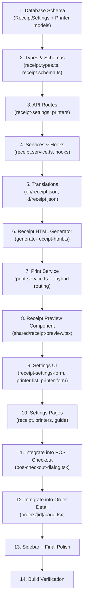

# Phase 5.5: Advanced Receipt & Hybrid Printer Management

Phase 5.5 introduces receipt generation, thermal printer management via QZ Tray (desktop) and RawBT (mobile), and a printer integration guide. It bridges Phase 5 (Orders) and Phase 6 (Reports) by completing the POS transaction lifecycle.

## User Review Required

> [!IMPORTANT]
> **Database Schema Changes** — This phase adds two new Prisma models (`ReceiptSettings` and `Printer`). These require a migration via `npx prisma migrate dev`. Please confirm before I run this.

> [!IMPORTANT]
> **New Package Required** — `qz-tray` npm package is needed for desktop ESC/POS printing via WebSocket. No new packages are needed for mobile (uses `intent://` URL scheme). Please confirm package install.

## Open Questions

> [!WARNING]
> **QZ Tray Certificate** — QZ Tray requires a signed certificate for production use. For development, the demo cert works. Should I set up a placeholder cert config, or skip cert validation for now?

> [!NOTE]
> **Store Settings Overlap** — Receipt settings (store name, address, footer text, Wi-Fi info) could live in the existing `Store` model or a dedicated `ReceiptSettings` model. I recommend a dedicated model for cleaner separation since it includes receipt-specific fields like `wifiPassword`, `footerText`, and `showLogo`. The `Store` model already has `name`, `address`, `phone` which we can reference.

---

## Proposed Changes

### 1. Database Schema

#### [MODIFY] [schema.prisma](file:///c:/Experience/projects/ai-pos-system/ai-pos-system/prisma/schema.prisma)

Add two new models:

```prisma
model ReceiptSettings {
  id            String  @id @default(uuid())
  storeId       String  @unique
  headerText    String? // Custom header above store name
  footerText    String? // Custom footer message (e.g., "Thank you!")
  wifiName      String? // Wi-Fi SSID to display
  wifiPassword  String? // Wi-Fi password to display
  showLogo      Boolean @default(false)
  showTax       Boolean @default(true)
  showAddress   Boolean @default(true)
  showPhone     Boolean @default(true)
  paperWidth    Int     @default(80) // 58mm or 80mm

  createdAt DateTime @default(now())
  updatedAt DateTime @updatedAt

  store Store @relation(fields: [storeId], references: [id], onDelete: Cascade)

  @@map("receipt_settings")
}

model Printer {
  id          String  @id @default(uuid())
  storeId     String
  name        String  // User-given name, e.g., "Kitchen Printer"
  deviceName  String  // System device name from QZ Tray scan
  type        String  @default("THERMAL") // THERMAL, LABEL, etc.
  isDefault   Boolean @default(false)
  isActive    Boolean @default(true)

  createdAt DateTime @default(now())
  updatedAt DateTime @updatedAt

  store Store @relation(fields: [storeId], references: [id], onDelete: Cascade)

  @@map("printers")
}
```

Also add to the `Store` model:
```prisma
receiptSettings ReceiptSettings?
printers        Printer[]
```

---

### 2. Types & Schemas

#### [NEW] [receipt.types.ts](file:///c:/Experience/projects/ai-pos-system/ai-pos-system/src/types/receipt.types.ts)

```typescript
interface ReceiptSettings { id, storeId, headerText, footerText, wifiName, wifiPassword, showLogo, showTax, showAddress, showPhone, paperWidth }
interface Printer { id, storeId, name, deviceName, type, isDefault, isActive }
interface ReceiptData { order, store, settings } // Composite type for rendering
```

#### [NEW] [receipt.schema.ts](file:///c:/Experience/projects/ai-pos-system/ai-pos-system/src/schemas/receipt.schema.ts)

- `receiptSettingsSchema` — Zod validation for receipt settings form
- `printerSchema` — Zod validation for adding/editing a printer

---

### 3. API Routes

#### [NEW] [api/receipt-settings/route.ts](file:///c:/Experience/projects/ai-pos-system/ai-pos-system/src/app/api/receipt-settings/route.ts)

| Method | Description |
|--------|-------------|
| `GET` | Get receipt settings for current store |
| `PUT` | Update receipt settings (upsert) |

#### [NEW] [api/printers/route.ts](file:///c:/Experience/projects/ai-pos-system/ai-pos-system/src/app/api/printers/route.ts)

| Method | Description |
|--------|-------------|
| `GET` | List all printers for current store |
| `POST` | Add a new printer |

#### [NEW] [api/printers/[id]/route.ts](file:///c:/Experience/projects/ai-pos-system/ai-pos-system/src/app/api/printers/%5Bid%5D/route.ts)

| Method | Description |
|--------|-------------|
| `PUT` | Update printer (name, set as default) |
| `DELETE` | Remove printer |

---

### 4. Services & Hooks

#### [NEW] [receipt.service.ts](file:///c:/Experience/projects/ai-pos-system/ai-pos-system/src/services/receipt.service.ts)

API call functions for receipt settings and printers.

#### [NEW] [use-receipt-settings.ts](file:///c:/Experience/projects/ai-pos-system/ai-pos-system/src/hooks/use-receipt-settings.ts)

TanStack Query hooks: `useReceiptSettings`, `useUpdateReceiptSettings`

#### [NEW] [use-printers.ts](file:///c:/Experience/projects/ai-pos-system/ai-pos-system/src/hooks/use-printers.ts)

TanStack Query hooks: `usePrinters`, `useCreatePrinter`, `useUpdatePrinter`, `useDeletePrinter`, `useSetDefaultPrinter`

---

### 5. Print Utility

#### [NEW] [print-service.ts](file:///c:/Experience/projects/ai-pos-system/ai-pos-system/src/services/print-service.ts)

Hybrid print routing utility:

```
detectPlatform() → 'desktop' | 'mobile' | 'unknown'

printReceipt(receiptHtml, printerName):
  if desktop → route via QZ Tray WebSocket (ESC/POS raw commands)
  if mobile  → route via intent:// URL to RawBT app
  else       → fallback to window.print()
```

#### [NEW] [generate-receipt-html.ts](file:///c:/Experience/projects/ai-pos-system/ai-pos-system/src/utils/generate-receipt-html.ts)

Pure function that takes `ReceiptData` and returns an HTML string formatted as a thermal receipt (58mm/80mm width).

---

### 6. UI Components

#### [NEW] [receipt-preview.tsx](file:///c:/Experience/projects/ai-pos-system/ai-pos-system/src/components/shared/receipt-preview.tsx)

**Reusable Receipt Preview component** — Used in both:
1. POS Checkout success dialog (after payment)
2. Order Detail page (for reprinting)

Renders the receipt in a styled dialog with a "Print" button that triggers hybrid print routing.

#### [NEW] [receipt-settings-form.tsx](file:///c:/Experience/projects/ai-pos-system/ai-pos-system/src/components/settings/receipt-settings-form.tsx)

Form (react-hook-form + Zod) for editing receipt settings (header, footer, Wi-Fi, toggles).

#### [NEW] [printer-list.tsx](file:///c:/Experience/projects/ai-pos-system/ai-pos-system/src/components/settings/printer-list.tsx)

Card-based list of configured printers with:
- Default toggle (radio-like: only one active at a time)
- Edit/Delete actions
- "Scan Printers" button (calls QZ Tray to discover)
- Active/Inactive status badges

#### [NEW] [printer-form.tsx](file:///c:/Experience/projects/ai-pos-system/ai-pos-system/src/components/settings/printer-form.tsx)

Dialog form for adding/editing a printer (name, device selection from scanned list).

---

### 7. Pages

#### [NEW] [settings/receipt/page.tsx](file:///c:/Experience/projects/ai-pos-system/ai-pos-system/src/app/%5Blocale%5D/%28dashboard%29/settings/receipt/page.tsx)

Receipt Settings page — Contains `ReceiptSettingsForm` and live receipt preview.

#### [NEW] [settings/printers/page.tsx](file:///c:/Experience/projects/ai-pos-system/ai-pos-system/src/app/%5Blocale%5D/%28dashboard%29/settings/printers/page.tsx)

Printer Management page — Contains `PrinterList` with scan, add, edit, delete, set-default.

#### [NEW] [settings/printers/guide/page.tsx](file:///c:/Experience/projects/ai-pos-system/ai-pos-system/src/app/%5Blocale%5D/%28dashboard%29/settings/printers/guide/page.tsx)

Printer Integration Guide — Step-by-step tutorials for:
1. Desktop: QZ Tray download, install, certificate setup
2. Mobile Android: RawBT download, Bluetooth pairing, intent configuration
3. Mobile iOS: Limitations note (no direct ESC/POS; use browser print)

All content via `next-intl` translation keys.

---

### 8. Modifications to Existing Files

#### [MODIFY] [pos-checkout-dialog.tsx](file:///c:/Experience/projects/ai-pos-system/ai-pos-system/src/components/pos/pos-checkout-dialog.tsx)

After successful order creation → show `ReceiptPreview` dialog with Print action (instead of just the order number).

#### [MODIFY] [orders/[id]/page.tsx](file:///c:/Experience/projects/ai-pos-system/ai-pos-system/src/app/%5Blocale%5D/%28dashboard%29/orders/%5Bid%5D/page.tsx)

Add "Print Receipt" button in the page header that opens the same `ReceiptPreview` component for reprinting.

#### [MODIFY] [app-sidebar.tsx](file:///c:/Experience/projects/ai-pos-system/ai-pos-system/src/components/shared/app-sidebar.tsx)

Add settings sub-routes for Receipt Settings and Printer Management under the System group (or link them from the Settings page).

---

### 9. Translations

#### [NEW] [messages/en/receipt.json](file:///c:/Experience/projects/ai-pos-system/ai-pos-system/messages/en/receipt.json)
#### [NEW] [messages/id/receipt.json](file:///c:/Experience/projects/ai-pos-system/ai-pos-system/messages/id/receipt.json)

Translation keys for:
- Receipt settings form labels & descriptions
- Printer management UI (scan, add, set default, delete, status)
- Receipt preview dialog (title, print button, reprint)
- Printer guide tutorials (QZ Tray steps, RawBT steps, iOS notes)
- Toast messages (success/error for all mutations)

---

## Implementation Order



---

## Verification Plan

### Automated Tests
```bash
npm run build   # Verify no TypeScript or build errors
npm run lint    # Verify no lint violations
```

### Manual Verification
- [ ] Receipt Settings page loads and saves correctly
- [ ] Printer Management shows scan/add/edit/delete/set-default flow
- [ ] POS Checkout → success → Receipt Preview dialog appears with Print button
- [ ] Order Detail page → "Print Receipt" opens same ReceiptPreview
- [ ] Printer Guide page renders full tutorial content in EN and ID
- [ ] Dark mode works on all new pages
- [ ] All UI text comes from translations (no hardcoded strings)
- [ ] No `any` types in any file
